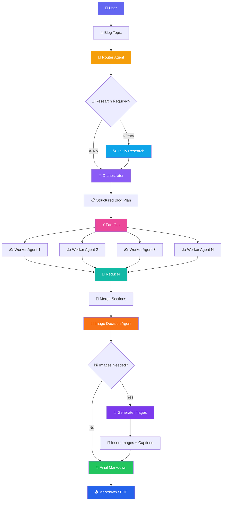
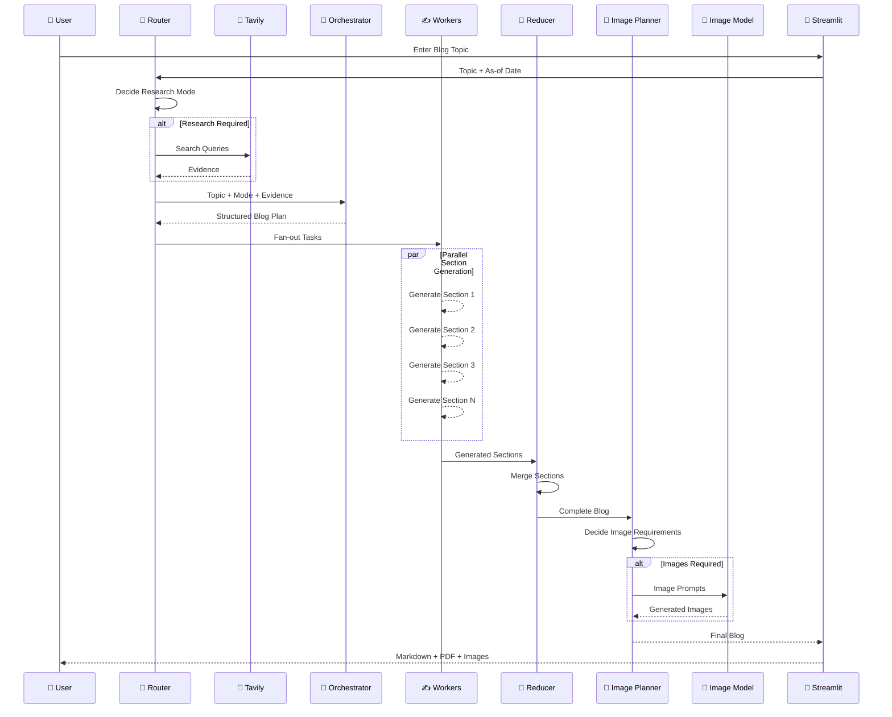

# ✍️ Multi-Agent Blog Writer

<div align="center">

### 🤖 AI-Powered Multi-Agent System for Research-Backed Blog Generation

**Plan → Research → Write → Merge → Generate Images → Publish**

[](https://www.python.org/)
[](https://www.langchain.com/langgraph)
[](https://www.langchain.com/)
[](https://openai.com/)
[](https://huggingface.co/)
[](https://streamlit.io/)
[](https://smith.langchain.com/)

</div>

---

## 🌟 Overview

**Multi-Agent Blog Writer** is an AI-powered content generation system built with **LangGraph and LangChain** that transforms a simple blog topic into a structured, research-backed, image-rich blog.

Instead of relying on a single LLM prompt, the system divides the writing process into specialized stages:

* 🧭 **Router Agent** — decides whether research is required
* 🔎 **Research Agent** — gathers current information when necessary
* 🧠 **Orchestrator Agent** — creates the complete blog plan
* ✍️ **Worker Agents** — independently write individual sections
* 🔗 **Reducer** — merges all generated sections
* 🎨 **Image Planner** — determines where visual content adds value
* 🖼️ **Image Generator** — generates and inserts images
* 📄 **Exporter** — produces Markdown and PDF output
* 📊 **LangSmith** — provides optional workflow tracing

The backend implements this workflow as a LangGraph state graph with conditional routing and parallel section generation.

---

# 🚀 What Makes It Multi-Agent?

Traditional AI blog generation:

```text
Topic
  ↓
LLM
  ↓
Blog
```

This project uses a collaborative agent architecture:

```text
Topic
  ↓
🧭 Router
  ↓
┌─────────────────────┐
│ Research Required?  │
└──────────┬──────────┘
           │
      ┌────┴────┐
      │         │
     YES        NO
      │         │
      ▼         │
 🔎 Research   │
      │         │
      └────┬────┘
           ▼
     🧠 Orchestrator
           │
           ▼
    📋 Blog Plan
           │
     ┌─────┼─────┐
     ▼     ▼     ▼
   ✍️ A   ✍️ B   ✍️ C
   Worker Worker Worker
     │     │     │
     └─────┼─────┘
           ▼
       🔗 Reducer
           │
           ▼
     🎨 Image Planner
           │
           ▼
      🖼️ Image Generator
           │
           ▼
       📝 Final Blog
```

---

# 🏗️ System Architecture



---

# 🧩 Agent Workflow

## 1️⃣ 🧭 Router Agent

The Router is the first decision-making agent.

It determines:

* Whether web research is required
* The type of blog
* Search queries when research is necessary
* Appropriate recency window

### Supported modes

| Mode             | Purpose                                                               |
| ---------------- | --------------------------------------------------------------------- |
| 📚 `closed_book` | Evergreen topics that don't require current information               |
| 🔀 `hybrid`      | Evergreen content with some current examples/tools/models             |
| 🌐 `open_book`   | Current news, latest developments, pricing, policies, weekly roundups |

## The Router produces a structured `RouterDecision` containing `needs_research`, `mode`, `queries`, and the reason for the decision.

# 🔎 2️⃣ Research Agent

When the Router determines that research is required, the system performs web research using **Tavily**.

```text
Topic
  ↓
Search Queries
  ↓
🔎 Tavily
  ↓
Raw Results
  ↓
🧠 Evidence Synthesizer
  ↓
Evidence Pack
```

The research stage:

* Executes multiple search queries
* Collects source URLs
* Extracts snippets
* Tracks publication dates when available
* Deduplicates sources
* Applies recency filtering for open-book content

---

# 🧠 3️⃣ Orchestrator Agent

The Orchestrator acts as the **senior content planner**.

It generates a structured blog plan containing:

* Blog title
* Target audience
* Tone
* Blog type
* Constraints
* Section tasks
* Section goals
* Key bullet points
* Target word counts
* Research requirements
* Citation requirements
* Code requirements

## Each blog is divided into **5–9 tasks** according to the planner instructions.

# ⚡ 4️⃣ Parallel Worker Agents

Once the blog plan is created, each task is sent to a separate **Worker Agent**.

```text
                📋 Blog Plan
                     │
                ⚡ Fan-Out
                     │
       ┌─────────────┼─────────────┐
       ▼             ▼             ▼
   ✍️ Worker 1   ✍️ Worker 2   ✍️ Worker 3
       │             │             │
       ▼             ▼             ▼
   Section 1      Section 2      Section 3
       │             │             │
       └─────────────┼─────────────┘
                     ▼
                  🔗 Reducer
```

LangGraph's `Send` mechanism is used to fan out individual tasks to the worker node.

Each worker is instructed to:

* Cover all assigned bullets
* Respect the target word count
* Write Markdown
* Follow the planned blog tone
* Use evidence when required
* Add citations for supported external claims
* Include code when requested

---

# 🔗 5️⃣ Reducer

After all workers finish, the generated sections are combined in their original task order.

```text
Section 1
   +
Section 2
   +
Section 3
   +
Section N
   ↓
🔗 Reducer
   ↓
Complete Blog
```

The reducer sorts sections by their task IDs and combines them into the final Markdown structure.

---

# 🎨 6️⃣ Intelligent Image Planning

The system doesn't blindly add images to every blog.

A dedicated image-planning agent decides whether visual content would actually improve the article.

### Image rules

* Maximum **3 images**
* Images should materially improve understanding
* Technical diagrams are preferred
* Decorative images are avoided
* Placeholders are inserted automatically

Example:

```text
[[IMAGE_1]]
[[IMAGE_2]]
[[IMAGE_3]]
```

The image planner produces structured image specifications containing:

* Placeholder
* Filename
* Alt text
* Caption
* Image prompt
* Size
* Quality

---

# 🖼️ 7️⃣ AI Image Generation

When images are required, the system generates them using a **Hugging Face-hosted Stable Diffusion XL model**.

```text
Image Prompt
     ↓
🤗 Hugging Face API
     ↓
Stable Diffusion XL
     ↓
Image Bytes
     ↓
images/
     ↓
Markdown Placeholder Replacement
```

The configured model endpoint is:

```text
stabilityai/stable-diffusion-xl-base-1.0
```

An `HF_TOKEN` environment variable is required for image generation.

---

# 🛡️ Graceful Image Failure

If image generation fails, the system doesn't completely destroy the blog.

Instead, it inserts an informative fallback block containing:

* Image caption
* Alt text
* Prompt
* Error information

This keeps the generated Markdown usable even when image generation fails.

---

# 📄 8️⃣ Blog Export

Generated blogs can be exported in multiple formats.

### 📝 Markdown

```text
blog-title.md
```

### 📄 PDF

The Streamlit application converts the generated Markdown into a PDF using **ReportLab**.

The UI provides dedicated download buttons for both Markdown and PDF.

---

# 🎨 Streamlit Interface

The application provides an interactive Streamlit dashboard.

### ⚙️ Blog Settings

Users can configure:

* 📝 Blog topic
* 📅 As-of date
* 🎨 Creativity / temperature
* 🐞 Debug logs

Then click:

**🚀 Generate Blog**

---

# 📑 Application Tabs

The interface contains four major tabs:

### 🧩 Plan

Displays:

* Generated blog title
* Section structure
* Task breakdown
* Target sections

### 📝 Blog Preview

Displays the final generated blog and provides:

* Markdown download
* PDF download
* Section count

### 📦 Assets

Displays generated images.

### 📊 Logs

Provides optional debugging information.

---

# 🔥 LangSmith Observability

The project includes optional **LangSmith tracing**.

When `LANGCHAIN_API_KEY` is available, tracing is enabled and the project is configured as:

```text
multi-agent-blog-writer
```

This makes it possible to inspect and monitor the LangGraph workflow and its agent execution.

---

# 🧠 Complete Workflow



---

# 🛠️ Tech Stack

## 🤖 AI / LLM

* OpenAI GPT-4o-mini
* LangChain
* LangGraph
* Pydantic

## 🔎 Research

* Tavily Search
* Structured evidence extraction
* Recency-aware research

## 🖼️ Image Generation

* Hugging Face Inference API
* Stable Diffusion XL

## 🎨 Frontend

* Streamlit
* Pandas

## 📄 Export

* ReportLab
* Markdown

## 📊 Observability

* LangSmith

---

# 📁 Project Structure

```text
multi-agent-blog-writer/
│
├── app.py
│
├── blog_backend.py
│
├── requirements.txt
│
├── .env
│
├── README.md
│
├── images/
│   ├── generated_image_1.png
│   ├── generated_image_2.png
│   └── ...
│
└── generated_blogs/
    ├── blog.md
    └── blog.pdf
```

> Keep `app.py` and `blog_backend.py` in the same project directory because the Streamlit frontend imports the LangGraph application from `blog_backend.py`.

---

# ⚙️ Installation

## 1. Clone the repository

```bash
git clone https://github.com/YOUR_USERNAME/multi-agent-blog-writer.git

cd multi-agent-blog-writer
```

## 2. Create a virtual environment

### Windows

```bash
python -m venv venv

venv\Scripts\activate
```

### macOS / Linux

```bash
python3 -m venv venv

source venv/bin/activate
```

## 3. Install dependencies

```bash
pip install -r requirements.txt
```

---

# 🔐 Environment Variables

Create a `.env` file in the project root:

```env
OPENAI_API_KEY=your_openai_api_key

TAVILY_API_KEY=your_tavily_api_key

HF_TOKEN=your_huggingface_token

LANGCHAIN_API_KEY=your_langsmith_api_key

LANGCHAIN_PROJECT=multi-agent-blog-writer
```

### Required depending on features

| Variable            | Purpose                |
| ------------------- | ---------------------- |
| `OPENAI_API_KEY`    | GPT-4o-mini            |
| `TAVILY_API_KEY`    | Web research           |
| `HF_TOKEN`          | AI image generation    |
| `LANGCHAIN_API_KEY` | LangSmith tracing      |
| `LANGCHAIN_PROJECT` | LangSmith project name |

## The code checks for `TAVILY_API_KEY` before performing research and `HF_TOKEN` before generating images. LangSmith tracing is enabled when `LANGCHAIN_API_KEY` is available.

# ▶️ Run the Application

Start the Streamlit application:

```bash
streamlit run app.py
```

Then open the local Streamlit URL shown in your terminal.

---

# 🧪 Example

### Input

```text
Topic:
"How Agentic AI is Transforming Software Development"
```

### Internal Workflow

```text
🧭 Router
   ↓
🔎 Research Required
   ↓
🌐 Tavily Search
   ↓
🧠 Blog Planning
   ↓
⚡ Parallel Workers
   ↓
🔗 Merge Sections
   ↓
🎨 Image Planning
   ↓
🖼️ Generate Technical Diagrams
   ↓
📝 Final Markdown
   ↓
📄 PDF Export
```

### Output

```text
📋 Blog Plan
        +
📝 Complete Blog
        +
🖼️ Generated Images
        +
📄 PDF
        +
📑 Markdown
```

---

# 💡 Example Blog Types

The planner supports:

* 📚 **Explainer**
* 🛠️ **Tutorial**
* 📰 **News Roundup**
* ⚖️ **Comparison**
* 🏗️ **System Design**

These types are represented directly in the structured `Plan` schema.

---

# 🔥 Key Engineering Concepts Demonstrated

This project demonstrates practical implementation of:

```text
🧠 Multi-Agent AI
        ↓
🔀 Conditional Routing
        ↓
⚡ Parallel Agent Execution
        ↓
📋 Structured Outputs
        ↓
🔎 Tool-Augmented Research
        ↓
🧩 LangGraph State Management
        ↓
🔗 Reducer / Aggregation Pattern
        ↓
🎨 Multimodal Generation
        ↓
📊 Observability
```

---

# 🔮 Future Improvements

* [ ] Add conversational editing of generated blogs
* [ ] Add human-in-the-loop review
* [ ] Add source citation verification
* [ ] Add SEO optimization agent
* [ ] Add plagiarism checking
* [ ] Add grammar/editor agent
* [ ] Add automatic table-of-contents generation
* [ ] Add social-media post generation
* [ ] Add Word/DOCX export
* [ ] Add persistent blog history
* [ ] Add user authentication
* [ ] Add cloud deployment
* [ ] Add Docker support
* [ ] Add more image-generation models
* [ ] Add configurable agent models
* [ ] Add token/cost tracking

---

# 📊 Why Multi-Agent Architecture?

A single LLM is responsible for too many tasks in a traditional content-generation pipeline.

**Multi-Agent Blog Writer** separates responsibilities:

| Agent               | Responsibility                    |
| ------------------- | --------------------------------- |
| 🧭 Router           | Decide whether research is needed |
| 🔎 Researcher       | Gather external evidence          |
| 🧠 Orchestrator     | Design blog structure             |
| ✍️ Workers          | Write individual sections         |
| 🔗 Reducer          | Combine sections                  |
| 🎨 Image Planner    | Decide where images help          |
| 🖼️ Image Generator | Generate visual assets            |

This separation makes the workflow more modular and easier to extend.

---

# 👨‍💻 Author

## Hrishav Raj

**B.Tech | AI / ML & Generative AI Enthusiast**

### Interests

`Artificial Intelligence` · `Machine Learning` · `Generative AI` · `LLMs` · `RAG` · `Agentic AI` · `LangChain` · `LangGraph`

---

<div align="center">

## ✍️ Multi-Agent Blog Writer

### **Research. Plan. Collaborate. Create.**

Built with ❤️ using

**Python · LangChain · LangGraph · OpenAI · Tavily · Hugging Face · Streamlit · LangSmith**

⭐ **If you find this project useful, consider giving it a star!**

</div>
